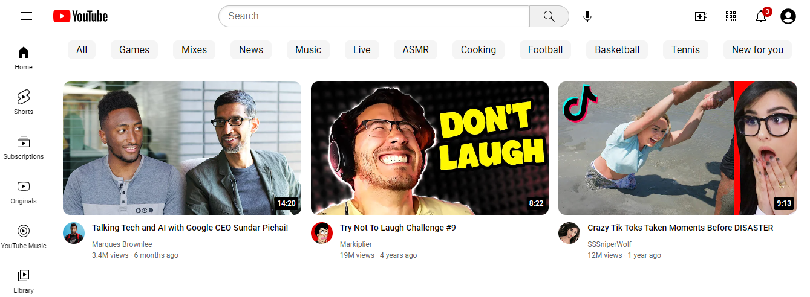

<h1 align="center">
    <a href="https://christosgkoutzis.github.io/YouTube-frontpage-clone/">
        <picture>
          <source media="(prefers-color-scheme: dark)" srcset="https://cdn.gtricks.com/2021/04/how-to-enable-youtube-dark-mode-on-pc-and-android-ios.jpg">
          <source media="(prefers-color-scheme: light)" srcset="icons/youtube-logo.svg" width=50%>
          
        </picture>
    </a>
</h1>

An updated version of the final project of the HTML-CSS course by SuperSimpleDev.

GitHub pages link: https://christosgkoutzis.github.io/YouTube-frontpage-clone/

<h4 align="center">
    
</h4>

    

## Inspiration - Purpose

Yes... Another famous webpage frontend clone just because you haven't had enough :D !!! This definetely isn't the most innovative project idea I can come up with but it is my very first project and the outcome of my first markup language course.

It's not a copycat of the course's final project as it has a bunch of improvements/changes that put my acquired HTML/CSS skills to the test without using the course's training wheels. 

The project's main goals are:

- To briefly demonstrate my acquired skills from SuperSimpleDev's HTML5 - CSS3 beginner's course as well as other courses and sources (f.e. Harvard's CS50x) that cover a wide variety of techniques and aspects related to these languages
(HTML attributes, Chrome Developer Tools, Nested Layout Technique, CSS Grid, CSS Flexbox, CSS Positions, Responsive Settings like media queries etc)
  
- To practice on a tutorial project acquired knowledge on Git technology and Linux CLI commands (clone by forking SuperSimpleDev's repository, branching, adding and commiting changes, pulling and pushing)

## Features - Usage and Development

The project delivers a nearly identical experience of the web version of youtube.com frontpage redirecting to the real youtube.com when the user interacts with it. Most of the components are 100% responsive in the current version but the page 
is not yet compatible with all kinds of mobile devices (!!TODO). The main features of the page are described more thoroughly by section below:

<h5>Course's version features</h5>

Header - Sidebar

  
Fixed header and sidebar with high-quality clickable icons leading to the respective sections of youtube.com. The main aspect implemented in these sections is CSS Position (relative, absolute, fixed)

Video Grid

  
A nearly identical to youtube.com video grid each video section of which, redirects to the actual youtube video. It's mainly designed using CSS Grid and Nested Layout Technique for the grid and opacity CSS property for the hidden tooltip that appears
when hovering over the creator's channel icon.

<h5>Features/changes after the course's version</h5>

Searchbar

  
Searchbar (instead of being static like the course's version) now expects user's input that passes as search_query HTTP attribute and searches for relevant videos on youtube.com

Shorts section

  
Implemented shorts section to make the clone page look closer to the actual YouTube homepage. The shorts thumbnails lead to the actual YouTube shorts.

Video Categories navbar

  
Included the navbar below the header that includes recommended video categories for the user. The categories do not lead to youtube.com yet (!!TODO).

## Roadmap
  
- Implement navigation arrows for the video category navbar (using JS)

- Implement funcionality for the hamburger menu button (change between sidebar navbars using JS)

## Contributing

This (as the forked repository) remains an open source project. Please feel free to let me know about your suggestions to improve the source code, ideas for new features or contact me about expanding this or other projects.

## Contributors

- <a href="https://github.com/SuperSimpleDev">SuperSimpleDev</a> (Created <a href="https://www.youtube.com/watch?v=G3e-cpL7ofc">this</a> amazing beginner HTML-CSS course that gave me the basic structure and features of the project as well as the knowledge to improve it)

- <a href="https://www.youtube.com/@imecreative5">ime creative</a> (His YouTube frontpage tutorial helped me in improving the visuals of the video category navbar)

- <a href="https://stackoverflow.com/users/1274378/bora-alp-arat">Bora Alp Arat</a> (His response to <a href="https://stackoverflow.com/questions/21684101/css-vertical-scrollbar-padding-left-right-in-ul-possible">this</a> question on Stack Overflow helped me understand how to add styles in my scrollbar (and especially the sense of padding of the scrollbar thumb)
  
## License

This project is licensed under the MIT license. 
